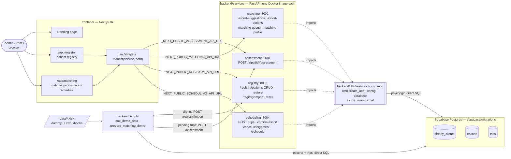
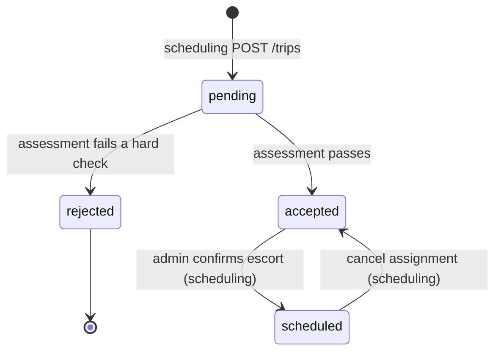

# KakiMETch architecture

Current state of the system. Product scope and business rules are in [AGENTS.md](../AGENTS.md).

## Components

- Services never import each other; shared code lives only in `kakimetch_common`.
- All four services share one database (no per-service schemas).
- The frontend does not talk to Supabase directly.
- Matching and scheduling both apply the escort hard filters from
  `kakimetch_common.escort_rules` (`load_escorts_for_slot` + `get_hard_filter_issues`), so
  suggestions and the final confirm check can never disagree.

## Trip lifecycle

Matching (suggestions, roster) is only allowed on `accepted` or `scheduled` trips. Confirming an
escort who fails a hard filter needs `assignment_override` plus a written reason.

## Running it

| Where | How |
|---|---|
| Docker | `docker compose up --build` (repo root; needs `backend/.env`) |
| Local | `make install-backend && make dev` |
| Database | apply `supabase/migrations/*.sql` in filename order |
| Demo data | `cd backend && python -m scripts.load_demo_data`, then `python -m scripts.prepare_matching_demo` |
