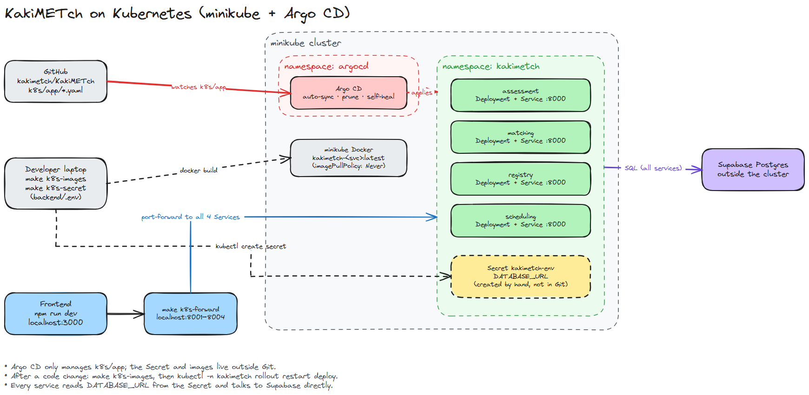

# Kubernetes (minikube + Argo CD)

Runs the four backend services on a local minikube cluster, synced from Git by Argo CD.
The frontend runs outside the cluster (`npm run dev`) and reaches the services through
port-forwards on 8001–8004, which are its default API URLs.

Source: [architecture.excalidraw](architecture.excalidraw) (open at excalidraw.com; re-export the PNG after editing).

## First-time setup

    minikube start
    make k8s-images                    # build the 4 images inside minikube's Docker
    make k8s-secret                    # namespace + Secret from backend/.env (never committed)
    kubectl create namespace argocd
    kubectl apply -n argocd --server-side -f https://raw.githubusercontent.com/argoproj/argo-cd/stable/manifests/install.yaml
    kubectl apply -f k8s/argocd-app.yaml
    make k8s-forward                   # keep this terminal open

If the Argo CD install fails with `conflict with "helm": .rules`, the cluster still has
Argo CD roles from an old Helm install; re-run the install command with `--force-conflicts`.

## Everyday

- Change manifests in `k8s/app/`, push → Argo syncs automatically (prune + self-heal on).
- Change code → `make k8s-images` then `kubectl -n kakimetch rollout restart deploy`
  (tags are `latest` with `imagePullPolicy: Never`, so Argo does not see image changes).
- Port-forwards attach to a pod, so restart `make k8s-forward` after pods are replaced.
- Argo UI: `kubectl -n argocd port-forward svc/argocd-server 8080:443`, user `admin`,
  password `kubectl -n argocd get secret argocd-initial-admin-secret -o jsonpath='{.data.password}' | base64 -d`.

## After the backend and k8s PRs merge

Set `targetRevision: main` in `k8s/argocd-app.yaml` and `kubectl apply -f k8s/argocd-app.yaml`.
